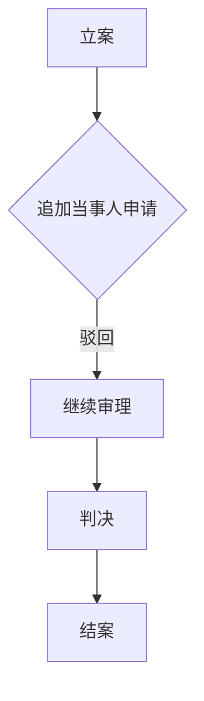

# 司法/行政文书程序与实体异常深度检测器（20260506版·26项事实认定精细化检测）

本技能是一套系统化、多维度的司法与行政文书审查框架，专为法律从业者、研究者及智能体设计。检测民商事判决、行政决定、劳动仲裁裁决、行政执法文书等各类法律文书中可能存在的**程序操作异常、证据审查不一致、事实认定模糊、法律适用脱节、自由裁量偏离及逻辑闭环断裂**等问题。**20260506版核心升级：维度三事实认定检测从5项扩展为26项精细化检测体系，新增翻案速查表，事实认定错误检测能力提升5倍。**

## 一、适用文书范围

- 民商事司法审判文书（判决书、裁定书、调解书）
- 劳动争议仲裁文书（裁决书、决定书）
- 行政诉讼与行政复议文书（判决书、裁定书、复议决定书）
- 行政执法与处理文书（行政处罚决定书、撤销立案告知书、处理意见书）

## 二、输入材料要求

| 优先级       | 材料名称                                       | 作用说明                                                     |
| :----------- | :--------------------------------------------- | :----------------------------------------------------------- |
| **必需**     | 核心文书全文                                   | 判决书/裁定书/裁决书/决定书等，需包含事实认定、裁判理由、裁判结果 |
| **强烈推荐** | 起诉状/答辩状/上诉状/申请书/投诉书             | 对比争议焦点是否被偏移或遗漏；检测语义漂移                   |
| **强烈推荐** | 双方证据清单及证据内容摘要/全文                | 检测证据审查一致性、关键证据处理情况与证据链完整性；构建证据图 |
| **强烈推荐** | 多阶段程序文书（如仲裁裁决+一审判决+二审判决） | 跨阶段版本差异分析，检测陈述演化与程序路径异常               |
| **推荐**     | 庭审/听证/调查笔录                             | 还原审理过程，检测程序过程异常与询问方式                     |
| **推荐**     | 程序性裁定/通知/决定                           | 如追加当事人申请、调查取证申请、管辖权异议的驳回裁定         |
| **推荐**     | 时间线材料（聊天记录时间戳、转账记录时间等）   | 时间一致性检测的基础数据                                     |
| **推荐**     | 案件背景与外部信息说明                         | 地域特征、行业惯例、舆论影响、办案人员与代理人的既往执业交集等人际网络关系 |

> [!WARNING]
> 若缺乏关键材料，在最终报告中标注“信息完整性受限”，并仅基于现有材料进行分析，所有结论需附加不确定性等级说明。

## 三、执行工作流

### Phase 0：结构化预处理与完整性校验

1. **材料覆盖度评分**：计算已提交材料与理想材料集的覆盖比例
2. **案件时间轴构建**：提取所有带时间戳的事件，构建全局时间线
3. **证据索引构建**：为每份证据分配唯一编号，建立证据属性表
4. **主张映射表构建**：提取起诉状/答辩状中的核心主张，建立主张ID

### Phase 1：信息解析与背景建构

1. 读取所有输入材料，提取案件基本信息（案号、当事人、案由、裁判结果）
2. 提取争议焦点、事实认定、证据清单、法律适用等核心内容
3. 提取用户提供的背景信息（地域、时间、人际网络等）作为上下文约束
4. 若材料不足，记录缺失项，在报告中标注

### Phase 2：图结构建模

构建三类核心图结构：

#### 2.1 Evidence Graph（证据关系图）
- **节点**：每份证据（含编号、类型、提交方）
- **边**：支持关系 / 冲突关系 / 补强关系

#### 2.2 Procedure Graph（程序行为图）
- **节点**：程序行为（立案、追加当事人申请、调查取证申请、延期申请、庭审、合议、裁判等）
- **边**：时间顺序 / 因果关系 / 选择性操作关系
- **检测目标**：行为链断裂、选择性程序操作、不合理路径依赖

#### 2.3 Legal Reasoning Graph（法律推理图）
- **路径**：Evidence → Fact → Legal Norm → Conclusion
- **检测目标**：推理链条中是否存在跳跃、缺失或逻辑倒挂

### Phase 3：智能检索与基准校对

**必须执行的联网检索任务：**

1. **法律法规检索**
   - 检索案件适用的最新法律、法规、司法解释
   - 检索相关地方性法规、部门规章
   - 确认法条当前有效性，识别已被废止或修订的内容

2. **指导性案例与类案检索**
   - 检索最高法/最高检发布的指导性案例
   - 检索公报案例、典型案例
   - 检索与文书同属一个省/直辖市管辖的类案
   - 检索最近5年的相关案例，建立“正常裁判基准”
   - **构建类案裁判结果分布**：计算同类案件在赔偿金额、责任比例、支持率等维度的均值与标准差

3. **行业规范与惯常做法检索**
   - 检索相关行政领域的行业规范
   - 检索地方通常交易习惯与司法实践惯例

4. **外部背景信息检索**（如用户提供线索）
   - 检索办案人员与代理律师的公开执业履历
   - 检索涉案实体、组织之间的公开互动与网络关系
   - 检索可能影响案件的舆论报道或社会事件

### Phase 4：十五维度深度扫描

按照本技能定义的十五大维度，将案卷材料与 Phase 3 建立的“基准”进行逐条比对，记录所有检测到的异常点，精准定位原文出处（页码/段落/行号/证据编号）。

### Phase 5：对抗校验与不确定性校准

对 Phase 4 识别的每个异常点，执行 Devil's Advocate 反向审查：

- **问题1**：是否存在合理的替代解释（如业务能力不足、材料缺失导致的误判）？
- **问题2**：若排除主观故意，该异常是否仍能成立？
- **问题3**：是否有相反证据或法理可推翻该异常判断？

根据校验结果，将每个异常标注为：
- ✅ **成立**（高置信异常）
- ⚠️ **存疑**（中度可疑，需更多材料验证）
- ❌ **不成立**（低度异常/误判）

### Phase 6：结构化报告生成

按照本技能定义的增强版报告模板生成 Markdown 格式检测报告。

## 四、核心检测维度

### 维度一：程序操作与正当性检测

**检测逻辑**：审查是否存在通过程序性操作影响真相查明路径或限制当事人程序权利的情形。

| 检测项            | 判定逻辑                                                     | 依据材料                                       |
| :---------------- | :----------------------------------------------------------- | :--------------------------------------------- |
| 拆分/合并案件     | 基于同一事实或法律关系的诉求是否被强制拆分或不当合并，导致事实认定脱节 | 判决书提及的关联案件案号；证据中提及的其他案件 |
| 追加当事人处理    | 对查明事实不可或缺的主体，办案机关是否无正当理由拒绝追加     | 追加当事人申请书、庭审笔录、判决书程序部分     |
| 简易/独任程序适用 | 争议标的额巨大或案情明显疑难复杂时，是否适用简易程序或独任审判 | 判决书首部“审判组织”栏                         |
| 管辖权操作        | 是否存在无管辖权立案受理、有管辖权违法移送、利用级别管辖拆分标的额等情形 | 管辖权异议裁定、判决书管辖部分                 |
| 送达与通知        | 对可知晓地址的当事人采用公告送达；开庭通知时间异常紧迫，变相影响出庭权利 | 送达回证、公告送达记录                         |
| 保全与先予执行    | 是否存在超标的保全、选择性保全；在事实不清时裁定先予执行     | 保全裁定、先予执行裁定                         |
| 辩论权与质证权    | 是否存在不当限制庭审时间、打断发言、禁止关键质证等情形       | 庭审笔录、当事人陈述                           |
| 调查取证义务      | 对当事人因客观原因无法取得的证据，办案机关是否无正当理由拒绝调取申请 | 调查取证申请书及法院答复                       |

### 维度二：证据采信与审查一致性检测

**检测逻辑**：对比双方证据的审查标准与采信情况，识别是否存在显著不一致或举证责任分配异常。

| 检测项            | 判定逻辑                                                     | 依据材料                                       |
| :---------------- | :----------------------------------------------------------- | :--------------------------------------------- |
| 举证责任分配      | 是否将法律明确规定应由特定方（如行政机关、用人单位）承担的举证责任，转由对方承担 | 判决书“本院认为”部分 vs 相关实体法举证责任规定 |
| 证据链评价        | 对形成逻辑闭环的多份证据，是否仅抽取片段进行评价，或以形式瑕疵全盘否定 | 原告证据清单 vs 判决书认证意见                 |
| 瑕疵/争议证据采信 | 是否采信无原件、无对方签字、单方制作、未经质证的证据作为定案依据 | 被告证据清单 vs 判决书认证意见                 |
| 同类证据审查标准  | 对双方提交的同类证据（如证人证言、微信记录）是否适用明显不同的采信标准 | 双方证据清单 vs 判决书认证意见比对             |
| 鉴定申请处理      | 对关键证据（如笔迹、形成时间）的鉴定申请是否无合理解释予以驳回 | 鉴定申请书及法院答复                           |

> [!NOTE]
> **交叉索引**：本维度与 **维度三·子类B（F-07至F-13）** 及 **维度三·子类C（F-14至F-19）** 深度交叉。证据采信的双重标准是事实认定错误的主要成因之一，建议将维度二与维度三联合审查，形成"证据采信异常→事实认定错误"的完整因果链条。

### 维度三：事实认定与关键情节记录检测（核心维度·26项精细化检测）

**检测逻辑**：事实认定是裁判文书的核心中枢，事实认定错误直接导致裁判结果失当。本维度将事实认定异常细分为五大类、26个具体检测项，覆盖从证据支撑、证据采信、证据排除、逻辑说理到举证责任的全链条。**大量司法实践表明，事实认定错误是二审改判和再审翻案的最高频理由——精准识别下述26类错误，翻案成功率可翻倍。**

> [!IMPORTANT]
> **翻案关键认知**：上诉/再审审查中，事实认定错误属于"硬伤"，一旦坐实，改判概率远高于单纯的法律适用争议。下述26项检测项中，任意一项被确证，均可作为独立的上诉/再审理由；若同时命中3项以上，建议立即启动程序内救济。

---

#### 3.1 子类A：事实认定的证据支撑缺陷（6项）

> 核心问题：判决认定的关键事实，缺乏充分、合法的证据支撑。

| 编号 | 检测项 | 判定逻辑 | 依据材料 | 翻案权重 |
|:---|:---|:---|:---|:---:|
| **F-01** | 无证据支撑的关键事实认定 | 文书"经审理查明"或"本院认为"中的肯定性事实陈述，在全部卷宗材料中找不到任何对应证据。即：**判决说了某件事，但整个案卷里没有任何证据能证明这件事。** 这是最严重的事实认定错误，属于"凭空认定"。 | 判决书事实部分 vs 双方全部证据内容 | ★★★★★ |
| **F-02** | 证据明显不足的事实认定 | 判决认定的关键事实，虽有证据提及，但证据数量、质量或证明力明显不足以达到高度盖然性的证明标准。例如：仅凭一份内容模糊的聊天记录认定大额借款合意；仅凭一张无签章的打印件认定合同关系。 | 判决书事实部分 vs 证据内容及证明力评估 | ★★★★ |
| **F-03** | 仅凭孤证认定核心事实 | 对案件核心争议事实（如合同是否成立、款项是否交付、劳动关系是否存在），仅凭单一证据即予认定，无任何其他证据补强。**孤证不能定案**是证据法基本原则，违反此原则构成重大事实认定错误。 | 判决书事实认定 vs 证据清单及证据链分析 | ★★★★★ |
| **F-04** | 事实认定前后相互矛盾 | 判决书在不同段落对同一事实的认定存在明显冲突。例如：前文认定"双方于3月1日签约"，后文又称"合同于4月生效"；前文认定"被告未付款"，后文又称"被告部分履行"。此类矛盾直接动摇裁判的逻辑基础。 | 判决书全文前后对比 | ★★★★★ |
| **F-05** | 时间线认定混乱错误 | 判决认定的关键事件时间节点与在案证据（合同、转账记录、聊天记录时间戳等）明显不符。包括：事件顺序颠倒、时间间隔计算错误、将不同时间发生的事件混为一谈。 | 判决书时间表述 vs 证据时间戳 | ★★★★ |
| **F-06** | 金额/主体关系认定错误 | 判决认定的金额（欠款数额、赔偿金额、工资标准等）与证据记载明显不符；或将A主体的行为认定为B主体的行为，导致责任主体认定颠倒。此类错误属于"硬伤"，一旦证实几乎必然改判。 | 判决书 vs 合同/转账凭证/工资单等 | ★★★★★ |

---

#### 3.2 子类B：证据采信偏差导致的事实认定错误（7项）

> 核心问题：法院在采信证据时适用双重标准——对对方证据降低门槛采信，对我方证据提高门槛排除，从而构建出偏向一方的事实基础。

| 编号 | 检测项 | 判定逻辑 | 依据材料 | 翻案权重 |
|:---|:---|:---|:---|:---:|
| **F-07** | 仅凭证人单方陈述认定事实 | 对关键事实的认定仅依赖单一证人的当庭陈述或书面证言，无任何书证、物证、电子数据等其他类型证据印证。证人证言具有主观性和不稳定性，单独作为定案依据违反证据补强规则。 | 判决书认证意见 vs 证据清单 | ★★★★ |
| **F-08** | 仅凭利害关系人证言定案 | 定案关键证据仅为与一方当事人存在利害关系的人员（如亲友、员工、商业合作伙伴、关联公司）的证言，且无其他中立证据印证。利害关系人证言的证明力天然较弱，单独定案构成重大瑕疵。 | 判决书认证意见 vs 证人身份及与当事人的关系 | ★★★★★ |
| **F-09** | 拔高弱证据效力强行认定 | 证据本身证明力很弱（如内容模糊的微信记录、无签章的文件复印件、单方制作的账目），法院却在判决中将其拔高为"足以认定"的核心证据，且未说明拔高效力的合理理由。 | 证据本身内容 vs 判决书对其证明力的评价 | ★★★★ |
| **F-10** | 采信有明显瑕疵的对方证据 | 对方提交的证据存在明显瑕疵——如签名/印章疑似伪造、内容有涂改痕迹、关键页面缺失、形成时间存疑——但法院仍予以采信并作为定案依据，且未对瑕疵作出合理解释。 | 对方证据原件/复印件 vs 判决书认证意见 | ★★★★★ |
| **F-11** | 采信逾期提交的对方证据 | 对方证据超过举证期限提交，法院未依据《民事诉讼法》及相关司法解释审查逾期原因，直接予以采信且未说明理由。程序性权利的差异化处理构成程序违法。 | 举证通知书/庭审笔录 vs 判决书认证意见 | ★★★★ |
| **F-12** | 无原件核对的证据直接定案 | 对方仅提供复印件、打印件或照片，始终未能提供原件供法庭核对，法院仍直接将其作为定案依据。**《民事诉讼法》明确规定书证应当提交原件**，无原件核对的复印件原则上不能单独作为认定案件事实的依据。 | 对方证据形式 vs 判决书认证意见 | ★★★★★ |
| **F-13** | 采信来源违法的证据 | 对方证据的取得方式违反法律禁止性规定（如非法窃听、私自拆封他人信件、非法侵入计算机系统获取），法院仍予以采信。**非法证据排除规则**是程序正义的底线，违反此规则构成严重程序违法。 | 证据来源说明 vs 判决书认证意见 | ★★★★★ |

---

#### 3.3 子类C：我方证据被不当排除或忽略（6项）

> 核心问题：我方提交的合法、有效证据，被法院以各种方式排除、忽略或不置可否，导致对我方有利的事实无法进入裁判视野。

| 编号 | 检测项 | 判定逻辑 | 依据材料 | 翻案权重 |
|:---|:---|:---|:---|:---:|
| **F-14** | 合法证据只字不提 | 我方提交的、形式合法内容明确的证据，在判决书全文（包括"经审理查明"和"本院认为"）中完全未被提及。**沉默即异常**——对足以影响裁判结果的证据保持沉默，构成事实认定遗漏。 | 我方证据清单及内容 vs 判决书全文检索 | ★★★★★ |
| **F-15** | 证据原件被无视不采信 | 我方提交了证据原件（合同原件、收据原件、银行流水原件等），法院在判决中未予采信，且未说明任何理由。原件具有最强的证明力，无视原件属于严重的证据审查失职。 | 我方证据原件 vs 判决书认证意见 | ★★★★★ |
| **F-16** | 未说明理由直接不采信 | 我方提交的关键证据，法院在判决中明确表示"不予采信"，但未给出任何法理或事实层面的理由说明。**说理是裁判文书的灵魂**——不说理的不采信等于没有审判。 | 判决书认证意见 vs 证据内容 | ★★★★★ |
| **F-17** | 未经质证即采纳或不采纳 | 我方提交的证据未经开庭质证程序，法院直接在判决中予以采纳或不采纳。**质证是证据采信的前置程序**，未经质证的证据不得作为认定案件事实的依据。此行为同时构成程序违法（维度一）和事实认定错误。 | 庭审笔录 vs 判决书认证意见 | ★★★★★ |
| **F-18** | 只看对方证据不审查我方抗辩证据 | 判决书的事实认定和证据分析部分，大量引用和评述对方提交的证据，对我方提交的抗辩证据（反证）几乎不予审查或一笔带过。**审判中立要求对双方证据给予平等关注**，选择性审查构成偏袒。 | 双方证据清单 vs 判决书证据评述篇幅对比 | ★★★★★ |
| **F-19** | 遗漏重要证据或关键案件事实 | 判决书遗漏了我方提交的某份重要证据（在证据清单中有记载但判决未提及），或因遗漏证据导致遗漏了某个关键案件事实（该事实可能改变裁判结果）。遗漏不同于不采信——遗漏意味着法院根本没有将该证据/事实纳入审理视野。 | 我方证据清单 vs 判决书全文 | ★★★★★ |

---

#### 3.4 子类D：逻辑与说理层面的认定错误（6项）

> 核心问题：判决在推理和说理过程中存在逻辑断裂、概念混乱、回避焦点等问题，导致事实认定与法律适用脱节。

| 编号 | 检测项 | 判定逻辑 | 依据材料 | 翻案权重 |
|:---|:---|:---|:---|:---:|
| **F-20** | 事实与法律不对应（张冠李戴） | 判决认定的事实（如"双方协商一致解除合同"）与最终适用的法律条文（如适用"单方违约"条款）之间不存在对应关系。事实是A，法律是B，两者被强行拼接。 | 判决书事实认定 vs 判决书法条适用 | ★★★★ |
| **F-21** | 因果关系认定颠倒 | 判决将本应由A行为导致的B结果，错误地归因于C行为；或将当事人因对方违约/侵权而采取的维权行为，错误地认定为"违约"或"同意"。因果链条的颠倒直接导致责任归属的错误判定。 | 判决书因果表述 vs 证据中的事件发展顺序 | ★★★★★ |
| **F-22** | 回避核心争议焦点 | 双方的核心争议焦点（如合同是否有效、款项性质是借款还是投资）在判决中被刻意回避或一笔带过，法院转而讨论次要问题或程序性问题，绕开对关键事实的认定。**回避即默认原判缺乏对核心争议的实质审理。** | 起诉状/答辩状核心诉求 vs 判决书说理重点 | ★★★★★ |
| **F-23** | 逻辑断裂：有事实无证据或有证据无法律依据 | 判决推理链条中存在明显的逻辑断裂：①认定了一个事实，但未引用任何证据支撑（有事实无证据）；②采信了一份证据，但未说明该证据指向何种法律后果（有证据无法律依据）。完整的裁判逻辑链应为：证据→事实→法律→结论，任一环节缺失即构成逻辑断裂。 | 判决书说理部分结构分析 | ★★★★ |
| **F-24** | 同一事实前后说理自相矛盾 | 判决书在前文（如"经审理查明"）和后文（如"本院认为"）对同一案件事实的表述或定性存在明显矛盾。例如：前文认定"原告多次催告"，后文又称"原告未履行通知义务"。此类矛盾直接暴露裁判逻辑的不自洽。 | 判决书全文前后对比 | ★★★★★ |
| **F-25** | 照搬模板套话未结合本案实际 | 判决书的"本院认为"部分大量使用模板化套话（如"证据不足，不予支持""于法无据，本院不予采纳"），未结合本案的具体证据、具体事实和具体争议进行有针对性的分析说理。**模板化判决等于没有审判**——它表明法院未对本案进行实质审理。 | 判决书"本院认为"部分 vs 本案具体证据和争议 | ★★★★ |

---

#### 3.5 子类E：举证责任分配错误（1项·高危害性）

> 核心问题：举证责任分配是民事诉讼的"游戏规则"，一旦分配错误，整个裁判结果必然失当。

| 编号 | 检测项 | 判定逻辑 | 依据材料 | 翻案权重 |
|:---|:---|:---|:---|:---:|
| **F-26** | 举证责任倒置错误 | 法律明确规定应由对方承担的举证责任（如用人单位对解除劳动合同合法性的举证责任、医疗机构对无过错的举证责任、经营者对产品无缺陷的举证责任），法院却错误地要求我方"自证清白"。**举证责任分配错误是最严重的程序兼实体错误**——它从根本上改变了诉讼的攻防结构，使本不应由我方承担的证明负担被强加于我方。 | 判决书举证责任分配表述 vs 实体法/程序法举证责任规定 | ★★★★★ |

---

#### 3.6 维度三异常检测综合判定指引

**单点异常**：仅命中1项 → 记录为事实认定瑕疵，可作为上诉理由之一

**多点异常**：命中3-5项 → **高度异常**，强烈建议启动程序内救济，改判概率显著提升

**系统性异常**：命中6项以上，且分布于至少3个子类 → **结构性偏差**，事实认定层面已构成重大审判瑕疵，建议同时考虑程序内救济与检察监督

> [!TIP]
> **实务操作建议**：在撰写上诉状/再审申请书时，建议按下述格式逐项列明事实认定错误：
> 
> 1. 引用判决书原文（第X页第Y行）——锁定错误表述
> 2. 引用对应证据（证据编号X）——证明正确事实
> 3. 指明对应的F编号（如F-01）——锚定错误类型
> 4. 简述该错误对裁判结果的影响——论证因果关系
> 
> 此种"四步法"使上诉理由具有极强的说服力和可核查性，大幅提升改判概率。

> [!NOTE]
> **与其他维度的交叉索引**：
> - F-07至F-13（证据采信偏差）与 **维度二：证据采信与审查一致性检测** 深度交叉，建议联合审查
> - F-17（未经质证）同时触发 **维度一：程序操作与正当性检测**
> - F-22（回避争议焦点）同时触发 **维度四：争议焦点归纳与回应检测**
> - F-24/F-25（说理矛盾/模板套话）同时触发 **维度八：文书表述与说理结构检测**
> - F-20/F-23（事实法律不对应/逻辑断裂）同时触发 **维度九：证据→事实→法律→结论逻辑链条检测**
> - F-05（时间线混乱）同时触发 **维度十三：时间一致性检测**
> - F-21（因果关系颠倒）同时触发 **维度十四：语义漂移与法律概念替换检测**
> - F-14/F-19（证据不提/遗漏）同时触发 **维度十五：缺失信息与负空间检测**

### 维度四：争议焦点归纳与回应检测

**检测逻辑**：审查归纳的争议焦点是否全面、准确，以及裁判说理是否逐一回应。

| 检测项   | 判定逻辑                                                     | 依据材料                                |
| :------- | :----------------------------------------------------------- | :-------------------------------------- |
| 焦点偏移 | 是否将“程序合法性审查”转换为“实体合理性审查”；或将“是否履职”转换为“是否属于受理范围” | 起诉状诉求 vs 判决书归纳的争议焦点      |
| 焦点遗漏 | 对当事人在诉状/答辩状中明确提出的核心诉求或关键证据异议，是否不予归纳、不予审理 | 起诉状/答辩状核心诉求 vs 判决书争议焦点 |
| 焦点虚化 | 是否将多个具体争议焦点概括为一个笼统的、无实质内容的焦点     | 判决书争议焦点归纳                      |

> [!NOTE]
> **交叉索引**：本维度与 **维度三·子类D·F-22（回避核心争议焦点）** 直接对应。争议焦点的偏移、遗漏或虚化，是事实认定错误在程序层面的"前奏"——法院通过重新定义争议焦点来规避对不利事实的认定。建议将维度四与维度三联合审查。

### 维度五：法律适用与检索参照检测

**检测逻辑**：审查法律规范的适用是否全面、准确，是否参照相关指导性案例。

| 检测项         | 判定逻辑                                                     | 依据材料                           |
| :------------- | :----------------------------------------------------------- | :--------------------------------- |
| 特别法适用情况 | 在劳动争议、消费者权益等有特别法规定的领域，是否回避特别法而适用一般法 | 判决书引用法条列表                 |
| 法条引用完整性 | 是否只引用对一方有利的条款，无视同一条文中的但书或关联强制性规定 | 判决书“本院认为”法条引用           |
| 法律规范有效性 | 是否援引已被废止或与案件性质明显不符的法律规范               | 判决书引用法条 vs 现行有效法律版本 |
| 法律概念界定   | 是否存在将“股权”界定为“期权”，将“被迫离职”认定为“协商一致解除”等概念替换 | 证据中的合同条款 vs 判决书定性描述 |
| 指导性案例参照 | 对最高法/最高检发布的指导性案例是否予以参照，是否存在同类案件裁判尺度显著不同的情形 | 类案检索结果 vs 本案裁判结果       |

### 维度六：自由裁量权行使与常规做法参照检测

**检测逻辑**：审查裁量结果是否显著背离司法与行政实践的常理、常情与常规做法。

| 检测项       | 判定逻辑                                                 | 依据材料                             |
| :----------- | :------------------------------------------------------- | :----------------------------------- |
| 比例原则体现 | 行政处罚或民事赔偿数额是否与过错程度、损害后果明显不匹配 | 判决书裁判结果 vs 行业惯例、类案判决 |
| 行业惯例参照 | 对行业内普遍认可的做法是否不予认可，且无充分说理         | 判决书说理 vs 行业规范检索结果       |
| 裁量幅度取值 | 在法定幅度内，是否持续、单向地偏向一方当事人取值         | 判决书裁判结果 vs 类案裁判尺度       |

### 维度七：外部背景与人际关系影响评估

**检测逻辑**：结合用户提供的背景信息，评估非法律因素对裁判的可能影响。

| 检测项        | 判定逻辑                                                     | 依据材料                               |
| :------------ | :----------------------------------------------------------- | :------------------------------------- |
| 地方保护迹象  | 本地龙头企业/纳税大户作为被告时的异常胜诉率；涉及外地当事人的案件裁判尺度存在差异 | 用户提供的背景信息 + 公开案例检索      |
| 人际网络关联  | 办案人员与代理律师是否存在曾同所执业、师生、亲属关联等未回避情形；当事人亲属在办案机关任职 | 用户提供的背景信息 + 公开执业信息检索  |
| 舆论/维稳压力 | 是否存在因应对突发舆情或维稳节点，作出突破法律底线的妥协性裁判 | 用户提供的背景信息 + 舆论报道检索      |
| 异常接触记录  | 是否存在办案人员私下会见一方当事人、接受请托的线索           | 用户提供的线索（如通话记录、宴请记录） |

### 维度八：文书表述与说理结构检测

**检测逻辑**：审查文书语言表述是否准确反映当事人主张，说理是否充分、逻辑是否连贯。

| 检测项         | 判定逻辑                                                     | 依据材料                        |
| :------------- | :----------------------------------------------------------- | :------------------------------ |
| 主张概括准确性 | 是否将当事人的具体诉求和理由概括为无关痛痒的表述             | 起诉状/答辩状原文 vs 判决书概括 |
| 说理充分性     | 是否仅以“于法无据，本院不予支持”等一句话概括，缺乏三段论推导 | 判决书“本院认为”部分            |
| 概念使用一致性 | 是否存在将当事人行为的法律性质进行不当替换（如将“被迫缺勤”写为“旷工”） | 证据原文 vs 判决书表述          |
| 文书制作规范性 | 是否存在张冠李戴的当事人信息、与本案无关的事实描述等复制粘贴错误 | 判决书全文                      |

> [!NOTE]
> **交叉索引**：本维度与 **维度三·子类D·F-24（前后说理自相矛盾）** 及 **F-25（照搬模板套话）** 直接对应。文书表述的模板化与逻辑不自洽，是事实认定缺乏实质审理的外在表征。建议将维度八与维度三·子类D联合审查。

### 维度九：证据→事实→法律→结论逻辑链条检测

**检测逻辑**：审查裁判文书各环节之间的逻辑推导关系是否存在硬性断裂。

| 检测项             | 判定逻辑                                             | 依据材料                       |
| :----------------- | :--------------------------------------------------- | :----------------------------- |
| 证据与事实对应     | 认定的“法律事实”是否能够从在案证据中合理推导出来     | 判决书事实部分 vs 证据内容     |
| 事实与法律适用匹配 | 认定的事实与最终适用的法律条文之间是否存在对应关系   | 判决书事实认定 vs 法条适用     |
| 争议焦点与说理对应 | 归纳的争议焦点在"本院认为"部分是否逐一展开论述或回应 | 判决书争议焦点 vs 本院认为部分 |

> [!NOTE]
> **交叉索引**：本维度与 **维度三·子类D·F-20（事实与法律不对应）** 及 **F-23（逻辑断裂）** 直接对应。逻辑链条检测是事实认定错误的"结构层面"验证——当证据→事实→法律→结论任一环节断裂，必然导致事实认定错误。建议将维度九与维度三·子类D联合审查。

### 维度十：庭审与程序过程行为记录检测

**检测逻辑**：从庭审笔录、程序记录中识别办案人员的倾向性行为表现。

| 检测项                 | 判定逻辑                                                     | 依据材料                       |
| :--------------------- | :----------------------------------------------------------- | :----------------------------- |
| 庭审中的倾向性表现     | 是否存在频繁打断一方发言、对一方证据要求过分苛刻、主动帮助一方“补漏”等情形 | 庭审笔录                       |
| 程序性申请的差异化处理 | 对一方的延期、调查取证申请一律驳回，对另一方则宽松处理       | 程序性裁定、庭审笔录           |
| 审限操作               | 是否存在异常加速（复杂案件极短时间审结）或异常拖延（简单案件久拖不决） | 判决书落款日期 vs 立案日期     |
| 合议庭/审委会运作      | 合议庭评议记录是否过于简单或与裁判结果明显不符；审委会讨论记录是否缺失 | 合议庭评议记录、审委会讨论记录 |

### 维度十一：执行与后续阶段异常检测

**检测逻辑**：将审查视野延伸至裁判生效后的执行阶段，发现协同性异常。

| 检测项       | 判定逻辑                                                     | 依据材料                 |
| :----------- | :----------------------------------------------------------- | :----------------------- |
| 执行障碍     | 对胜诉方申请执行是否设置不合理障碍；对被执行人财产是否选择性不保全 | 执行裁定、当事人陈述     |
| 财产处置价格 | 在执行拍卖、变卖中，财产评估价、成交价是否明显低于市场价     | 拍卖公告、成交记录       |
| 执行和解     | 执行和解条件是否对一方明显不公，且当事人反映系被迫接受       | 执行和解协议、当事人陈述 |

### 维度十二：异常耦合组合情形（综合判定）

**检测逻辑**：单个维度的异常可能源于业务水平或偶然因素，但当**多个维度的异常同步出现，且所有异常指向均对同一方当事人有利**时，提示存在**结构性偏差**。

**触发条件**：在维度一至五中，每类至少触发**1项**警报，且全部指向对特定一方有利。

**典型组合路径**：
1. 程序上：拆分案件/拒绝追加当事人，切断证据关联
2. 证据上：审查标准不一致或举证责任分配偏离，构建有利于一方的事实基础
3. 事实上：关键证据未予评述，因果链条表述调整
4. 法律上：回避特别法或概念替换，改变案件定性
5. 逻辑上：说理简略，形成逻辑闭环表象

### 维度十三：时间一致性检测

**检测逻辑**：审查所有关键事件、证据形成、程序行为在时间维度上的逻辑一致性，识别时间倒挂、异常加速、异常拖延、版本演化不一致等问题。

| 检测项           | 判定逻辑                                                     | 依据材料                         |
| :--------------- | :----------------------------------------------------------- | :------------------------------- |
| 证据形成时间异常 | 关键证据的形成时间晚于争议事件发生时间，或早于其声称的形成时间 | 证据本身的时间戳 vs 事件时间线   |
| 陈述时间漂移     | 同一当事人在不同阶段（投诉/仲裁/一审/二审）对同一事实的陈述发生实质性变化，且无合理解释 | 多阶段文书对比                   |
| 审限异常加速     | 复杂案件在极短时间内审结（如立案后7日内判决），且无简易程序适用说明 | 立案日期 vs 判决日期             |
| 审限异常拖延     | 简单案件审理周期远超法定审限，且无延长审批记录               | 立案日期 vs 判决日期 vs 法定审限 |
| 程序行为逆序     | 程序行为的发生顺序不符合法定逻辑（如先裁定后听证、先执行后裁决） | 程序性文书时间戳                 |
| 证据链时间冲突   | 多份证据共同指向的事实，其各自时间标注存在无法解释的矛盾     | 证据时间线交叉比对               |

> [!NOTE]
> **交叉索引**：本维度与 **维度三·子类A·F-05（时间线认定混乱错误）** 直接对应。时间一致性是事实认定的"硬约束"——时间不会说谎，时间线上的矛盾是最难被反驳的事实认定错误类型。建议将维度十三与F-05联合审查。

### 维度十四：语义漂移与法律概念替换检测

**检测逻辑**：对比原始材料（起诉状、答辩状、证据原文、庭审陈述）与裁判文书中的表述，识别关键法律语义的替换、弱化、转移或重构。重点检测是否通过语言操作改变法律定性。

| 检测项            | 判定逻辑                                                     | 依据材料                                | 示例                                                         |
| :---------------- | :----------------------------------------------------------- | :-------------------------------------- | :----------------------------------------------------------- |
| 法律概念替换      | 将A法律概念替换为B，从而改变法律适用路径                     | 证据中的合同条款/行为描述 vs 判决书定性 | “股权”替换为“期权”；“被迫离职”替换为“协商一致解除”           |
| 行为强度弱化      | 将具有明确法律意义的强行为描述为中性或模糊行为               | 起诉状事实描述 vs 判决书事实认定        | “明确拒绝履行”写为“存在争议”；“暴力抗拒”写为“发生冲突”       |
| 责任主体转移      | 通过语言表述将本应由一方承担的责任描述为双方共同行为或对方行为 | 证据内容 vs 判决书表述                  | “被告单方终止合同”写为“双方协商终止未果”                     |
| 因果关系重构      | 调整事件发生顺序或逻辑关联，使因果关系指向发生改变           | 时间线 vs 判决书因果表述                | 将“因被告违约导致原告损失”写为“原告损失后被告未能配合”       |
| 法律术语误用/滥用 | 使用与案件事实不符的法律术语，从而适用不同的法律规则         | 证据中的行为特征 vs 法律术语构成要件    | 将“劳务关系”认定为“承揽关系”；将“消费者”认定为“非为生活消费需要” |

**语义漂移严重性分级**：
- **轻微**：不影响法律定性的措辞调整
- **中度**：可能影响法律定性的表述变化
- **严重**：直接改变法律定性的概念替换

> [!NOTE]
> **交叉索引**：本维度与 **维度三·子类D·F-21（因果关系认定颠倒）** 直接对应。语义漂移（尤其是因果关系重构）是事实认定错误在语言层面的实现手段——法院通过调整措辞来改变事实的法律定性。建议将维度十四与F-21联合审查。

### 维度十五：缺失信息与负空间检测

**检测逻辑**：基于案件类型、诉讼请求、证据清单和法律适用规则，构建“应当出现的信息集合（Expected Set）”，与裁判文书中“实际出现的信息集合（Actual Set）”进行比对。缺失项（Missing = Expected − Actual）本身即构成异常信号。

**数学定义**：

$$\text{Expected Set} = \{\text{法定应当审查的事项}\} \cup \{\text{当事人明确提出的核心主张}\} \cup \{\text{足以影响裁判结果的关键证据}\}$$

$$\text{Actual Set} = \{\text{文书中明确记载并评述的事项}\}$$

$$\text{Missing Set} = \text{Expected Set} - \text{Actual Set}$$

| 检测项             | 判定逻辑                                                     | 依据材料                                     |
| :----------------- | :----------------------------------------------------------- | :------------------------------------------- |
| 核心主张缺失       | 当事人在起诉状/答辩状中明确提出的核心诉求或抗辩理由，在裁判文书中未被归纳为争议焦点，且在“本院认为”部分未被回应 | 起诉状/答辩状主张清单 vs 判决书全文          |
| 关键证据未评述     | 对一方提交的、足以影响事实认定的关键证据，在“经审理查明”或“本院认为”部分完全未提及或未予评述 | 证据清单 vs 判决书全文                       |
| 应适用法条缺失     | 根据案件性质和争议焦点，依法应当适用的强制性规范或特别法规定，在裁判文书中未被引用 | 案件定性 vs 应适用法律规范 vs 判决书引用法条 |
| 逻辑链缺失环节     | 在“证据→事实→法律→结论”的推理链条中，存在无法衔接的跳跃，缺少必要的中间论证环节 | 判决书说理部分结构分析                       |
| 对方有利事实遗漏   | 对一方当事人有利的、在案证据能够证明的事实，在“经审理查明”部分未予记载 | 有利方证据 vs 判决书事实认定部分             |
| 程序性权利告知缺失 | 法定应当告知当事人的程序性权利（如申请回避权、上诉权、复议权等）未在文书中体现 | 文书程序部分 vs 法定告知义务                 |

**缺失信息重要性分级**：
- **低**：缺失不影响裁判结果的辅助性信息
- **中**：缺失可能影响裁判结果的关联信息
- **高**：缺失直接影响裁判结果的核心信息

> [!NOTE]
> **交叉索引**：本维度与 **维度三·子类C·F-14（合法证据只字不提）** 及 **F-19（遗漏重要证据或关键事实）** 直接对应。负空间检测是发现"沉默型"事实认定错误的核心工具——法院通过"不说"来规避对不利事实的认定，这种沉默本身就是最隐蔽的异常信号。建议将维度十五与维度三·子类C联合审查。

---

## 四-A、事实认定错误快速对照清单（26条·翻案速查表）

> [!CAUTION]
> **收到判决书别慌！对照以下26个细节逐一核查事实认定错误，翻案成功率翻倍。**
> 
> 本清单是维度三26项精细化检测的浓缩速查版，按"先易后难、先硬伤后软伤"的顺序排列，便于快速筛查。**标注"硬伤"的项目一旦坐实，改判概率极高。**

### 第一轮速查：硬伤型错误（坐实即翻案·9项）

| 序号 | 编号 | 速查问题 | 错误类型 | 核查方法 |
|:---:|:---|:---|:---|:---|
| 1 | F-01 | 判决认定的关键事实，有没有**任何**证据支撑？ | 凭空认定·硬伤 | 逐句核对"经审理查明"中的每个事实陈述，在证据清单中找对应证据 |
| 2 | F-03 | 核心事实是否**仅凭孤证**就认定了？ | 孤证定案·硬伤 | 检查认定核心事实所依据的证据数量，是否为单一证据 |
| 3 | F-06 | 金额计算是否正确？主体关系是否认定颠倒？ | 计算/主体错误·硬伤 | 用计算器复核判决中的金额；核对合同/凭证中的主体名称 |
| 4 | F-12 | 对方证据**无原件核对**，法院直接作为定案依据？ | 无原件定案·硬伤 | 检查对方证据形式，是否有原件核对记录 |
| 5 | F-10 | 对方证据存在**明显瑕疵**（伪造/涂改），却被采信？ | 采信瑕疵证据·硬伤 | 检查对方证据原件，比对签名/印章/涂改痕迹 |
| 6 | F-26 | **本该对方举证**，法院却要求我方自证清白？ | 举证责任倒置·硬伤 | 查阅实体法举证责任规定，对比判决书中的举证责任分配 |
| 7 | F-17 | 我方证据**未经开庭质证**，法院直接采纳或不采纳？ | 未经质证·硬伤 | 核对庭审笔录，确认每份证据是否经过质证环节 |
| 8 | F-04 | 判决认定的事实**前后相互矛盾**？ | 事实矛盾·硬伤 | 全文对比判决书不同段落对同一事实的表述 |
| 9 | F-24 | 同一事实，判决**前后说理自相矛盾**？ | 说理矛盾·硬伤 | 对比"经审理查明"与"本院认为"对同一事实的表述 |

### 第二轮速查：证据排除型错误（6项）

| 序号 | 编号 | 速查问题 | 错误类型 | 核查方法 |
|:---:|:---|:---|:---|:---|
| 10 | F-14 | 我方提交的**合法证据**，判决书是否**只字不提**？ | 证据沉默 | 在我方证据清单中逐份检索判决书全文，确认是否被提及 |
| 11 | F-15 | 我方提交的**证据原件**，是否被无视不采信？ | 无视原件 | 检查我方原件证据在判决书中的采信情况 |
| 12 | F-16 | 我方关键证据不被采信，判决**是否说明了理由**？ | 不说理排除 | 检查"不予采信"后是否有理由说明 |
| 13 | F-19 | 判决是否**遗漏**了我方的重要证据或关键事实？ | 遗漏证据/事实 | 比对证据清单与判决书，确认每份证据是否被纳入审理 |
| 14 | F-18 | 判决是否**只看对方证据**，不审查我方抗辩证据？ | 选择性审查 | 统计判决书对双方证据的评述篇幅和深度 |
| 15 | F-25 | 判决是否**照搬模板套话**，未结合本案实际分析？ | 模板化判决 | 检查"本院认为"是否有针对本案具体证据和事实的分析 |

### 第三轮速查：证据采信偏差型错误（5项）

| 序号 | 编号 | 速查问题 | 错误类型 | 核查方法 |
|:---:|:---|:---|:---|:---|
| 16 | F-08 | 是否**仅凭利害关系人证言**（亲友/员工/合作伙伴）定案？ | 利害关系人证言 | 核查定案关键证人与当事人的关系 |
| 17 | F-07 | 是否**仅凭证人单方陈述**认定事实，无其他证据印证？ | 单方陈述定案 | 检查证人证言是否有书证/物证等其他证据补强 |
| 18 | F-09 | 证据**证明力很弱**，法院是否拔高其效力强行认定？ | 拔高弱证据 | 评估被采信证据的实际证明力，对比判决书对其的评价 |
| 19 | F-11 | 对方证据**逾期提交**，法院是否仍采信且未说明理由？ | 采信逾期证据 | 核对举证期限通知与证据实际提交时间 |
| 20 | F-13 | 对方证据**来源违法**（非法获取），法院是否仍采信？ | 采信非法证据 | 审查对方证据的取得方式是否合法 |

### 第四轮速查：逻辑与说理型错误（6项）

| 序号 | 编号 | 速查问题 | 错误类型 | 核查方法 |
|:---:|:---|:---|:---|:---|
| 21 | F-02 | 判决认定的关键事实，**证据是否明显不足**？ | 证据不足 | 评估支撑每个关键事实的证据是否达到高度盖然性标准 |
| 22 | F-05 | 判决认定的**时间线是否混乱错误**？ | 时间线错误 | 用证据时间戳构建正确时间线，对比判决书时间表述 |
| 23 | F-20 | 判决说理中，**事实与法律是否不对应**（张冠李戴）？ | 事实法律错配 | 检查认定的事实与适用的法条之间是否存在逻辑对应关系 |
| 24 | F-21 | 判决说理中，**因果关系认定是否颠倒**？ | 因果颠倒 | 还原事件发展顺序，对比判决书中的因果表述 |
| 25 | F-22 | 判决是否**回避了双方的核心争议焦点**？ | 回避焦点 | 对比起诉状/答辩状核心诉求与判决书说理重点 |
| 26 | F-23 | 判决逻辑是否断裂：**有事实无证据，或有证据无法律依据**？ | 逻辑断裂 | 逐环节检查证据→事实→法律→结论链条的完整性 |

### 使用说明

1. **逐条打勾**：拿到判决书后，按上述26条逐一核查，在核查方法指导下逐条打勾确认
2. **优先硬伤**：第一轮9项硬伤型错误应优先核查——任一项坐实，即可作为独立上诉理由
3. **组合使用**：命中3项以上（尤其是跨子类命中），建议立即启动程序内救济
4. **四步法呈现**：在文书中按"引用判决原文→引用对应证据→指明F编号→论述影响"四步法呈现
5. **联合维度**：结合维度二（证据采信）、维度四（争议焦点）、维度九（逻辑链条）进行交叉验证

> [!TIP]
> **翻案成功率评估**：
> - 仅命中1-2项第四轮错误 → 翻案成功率约20-30%（需结合法律适用争议）
> - 命中1-2项硬伤型错误 → 翻案成功率约50-70%
> - 命中3项以上硬伤 + 跨子类分布 → 翻案成功率约80%以上
> - 命中6项以上且分布于3个子类以上 → 几乎必然改判或发回重审

---

## 五、类案偏离量化分析

### 5.1 偏离度计算模型

**定义**：

$$\text{Deviation Score} = \frac{|\text{本案裁判结果值} - \text{类案裁判结果均值}|}{\text{类案裁判结果标准差}}$$

**结果值映射规则**：
- 对于赔偿金额、罚金数额等连续变量：直接使用数值
- 对于责任比例（如三七开、五五开）：映射为0-1之间的比例值
- 对于定性结果（支持/驳回）：构建支持率指标（如对某一类主张的支持频率）

### 5.2 偏离度判定标准

| Deviation Score 区间 | 含义                      | 信号等级     |
| :------------------- | :------------------------ | :----------- |
| < 0.5                | 完全位于正常波动范围内    | 无异常信号   |
| 0.5 ~ 1.0            | 位于正常波动边缘          | 弱异常信号   |
| 1.0 ~ 2.0            | 显著偏离类案均值          | 中度异常信号 |
| > 2.0                | 极端偏离，超出95%置信区间 | 高度异常信号 |

### 5.3 类案检索要求

- 检索范围：同省/直辖市近5年同类案由裁判文书
- 最低样本量：不少于10件
- 排除条件：明显不同事实基础或法律争议焦点的案件
- 加权考虑：指导性案例、公报案例的权重高于普通案例

## 六、程序行为链分析（Procedure Graph）

### 6.1 图结构定义

**节点类型**：
- `START`：案件受理/立案
- `MOTION`：程序性申请（追加当事人、调查取证、延期、回避等）
- `RULING`：程序性裁定/决定
- `HEARING`：庭审/听证
- `EVIDENCE`：证据处理行为（接收、调取、鉴定、质证）
- `JUDGMENT`：裁判行为
- `END`：程序终结

**边类型**：
- `NEXT`：时间上的先后顺序
- `CAUSE`：因果关系（A决定导致B发生）
- `SELECTIVE`：选择性操作（对一方申请处理而对另一方类似申请不处理）
- `DELAY`：异常延迟

### 6.2 异常路径模式识别

| 异常模式         | 图结构特征                                                   | 含义                         |
| :--------------- | :----------------------------------------------------------- | :--------------------------- |
| **选择性阻断**   | 对一方当事人的MOTION节点，缺少对应的RULING节点或仅有驳回而无说理 | 程序权利不对等               |
| **证据链捷径**   | EVIDENCE节点不足，但JUDGMENT节点直接认定事实                 | 证据不足情况下认定事实       |
| **循环驳回**     | 当事人多次提出MOTION，均被RULING驳回，且驳回理由相同         | 程序性权利被系统性压制       |
| **跳跃裁判**     | 从START直接到JUDGMENT，缺少HEARING或关键EVIDENCE节点         | 程序严重简化，可能剥夺辩论权 |
| **异常加速路径** | START到JUDGMENT的时间边权重显著低于法定或常规值              | 审限异常，可能为配合外部因素 |

### 6.3 输出要求

在检测报告中，以文字描述或 Mermaid 流程图形式呈现 Procedure Graph，并标注检测到的异常路径。


## 七、多Agent对抗校验机制

### 7.1 Agent架构定义

| Agent                      | 职责                                                         |
| :------------------------- | :----------------------------------------------------------- |
| **Parser Agent**           | 解析输入材料，提取结构化信息，构建时间线、证据索引、主张映射 |
| **Graph Builder Agent**    | 构建 Evidence Graph、Procedure Graph、Legal Reasoning Graph  |
| **Retriever Agent**        | 执行联网检索，构建类案分布、法条有效性验证、外部背景信息     |
| **Analyzer Agent**         | 执行十五维度扫描，生成初步异常清单                           |
| **Devil's Advocate Agent** | 对每个异常点进行反向审查，提出替代解释，评估异常成立可能性   |
| **Judge Agent**            | 综合所有Agent输出，进行异常耦合判定，生成最终异常等级        |
| **Auditor Agent**          | 复核所有结论的可追溯性（是否绑定原文/证据/法条），剔除无依据推断 |

### 7.2 对抗校验执行规则

对于 Analyzer Agent 输出的每个异常点，Devil's Advocate Agent 必须回答以下三个问题，并给出结论：

| 问题                                           | 回答要求                                                     |
| :--------------------------------------------- | :----------------------------------------------------------- |
| **Q1：是否存在合理的替代解释？**               | 列举至少一个可能的非主观偏差解释（如：法官业务能力不足、案卷材料缺失导致、法律理解差异等） |
| **Q2：若排除主观故意，该异常是否仍能成立？**   | 判断异常是基于客观标准（如违反法定程序、偏离类案均值），还是依赖对主观意图的推测 |
| **Q3：是否有相反证据或法理可推翻该异常判断？** | 检查案卷中是否存在可消解该异常的相反证据，或是否存在支持该操作的非常规法理依据 |

**校验结论**：
- **✅ 异常成立**：三个问题均无法有效推翻异常判断
- **⚠️ 异常存疑**：存在合理的替代解释，但无法完全消解异常信号
- **❌ 异常不成立**：替代解释充分或存在相反证据，异常信号可被消解

## 八、异常耦合与结构性偏差判定

### 8.1 单维异常 vs 多维异常

- **单维异常**：仅在某一维度检测到异常，且其他维度正常 → 可能为偶然因素或能力不足
- **多维异常**：在两个及以上维度检测到异常 → 需进一步分析异常指向

### 8.2 异常耦合触发条件

同时满足以下三个条件时，判定为 **“结构性偏差”** ：

1. **维度覆盖**：在以下维度类别中，至少 **三个类别** 各触发至少1项高置信异常：
   - **程序类**（维度一、十）
   - **证据类**（维度二、九）
   - **事实类**（维度三、四）
   - **法律类**（维度五、六）
   - **新增类**（维度十三、十四、十五）

2. **指向一致性**：所有触发的异常，其效果均对 **同一方当事人有利**

3. **偏离度验证**：类案偏离量化分析的 Deviation Score ≥ 1.0，或 Procedure Graph 分析识别出选择性操作路径

### 8.3 结构性偏差的含义

> 结构性偏差指在多个审查维度上出现同步、指向一致的异常操作，且异常程度超出通常的业务能力波动范围或偶然因素可解释范围。此种偏差提示可能存在系统性的程序控制、证据筛选或法律适用倾向，建议启动更高层级的审查程序。

## 九、报告输出规范

### 9.1 文件命名规则

`{Agent名称}_司法行政文书异常检测报告_{案件简称}_{YYYYMMDD}.md`

示例：`QClaw_司法行政文书异常检测报告_张某劳动争议案_20260421.md`

### 9.2 增强版报告模板

````markdown
# 司法/行政文书程序与实体异常深度检测报告

> [!NOTE]
> **基础信息档案**
> - **案件名称/案号**：[提取案号]
> - **文书类型**：[判决书/裁决书/决定书等]
> - **分析模型**：[模型名称]
> - **检测时间**：[YYYY-MM-DD]
> - **材料完整性评分**：[XX/100]
> - **审查基准法源**：[列举检索到的关键法条及指导案例摘要]

> [!CAUTION]
> **综合异常等级：[低度异常 / 中度异常 / 高度异常 / 结构性偏差]**
> 
> **评级理由**：[简述评级依据。若触发结构性偏差，必须明确说明触发维度及指向一致性]

---

## 一、核心异常总览

| 维度 | 异常检测项 | 简要表现 | 指向获益方 | 置信度 |
|:---|:---|:---|:---|:---|
| [维度X] | [项名称] | [一句话描述] | [某方] | ✅/⚠️ |

---

## 二、深度异常剖析

### 2.1 [维度名称] 异常分析

> [!WARNING]
> **触发项**：[具体检测项名称]
> **原文定位**：[文书第X页第Y行，具体段落]
> **证据对照**：[证据编号X / 起诉状主张Y]
> **法理/背景点评**：[详细论述]
> **对抗校验结论**：[✅成立 / ⚠️存疑 / ❌不成立] —— [简述理由]

*(遍历所有触发的维度进行上述结构输出)*

---

## 三、时间一致性分析

### 3.1 案件时间线

| 时间节点 | 事件描述 | 来源 |
|:---|:---|:---|
| [YYYY-MM-DD] | [事件] | [证据编号/文书页码] |

### 3.2 时间异常点

- **[异常点1]**：[描述] —— [严重程度]
- **[异常点2]**：[描述] —— [严重程度]

---

## 四、语义漂移分析

| 原始表述 | 来源 | 文书表述 | 漂移类型 | 严重性 |
|:---|:---|:---|:---|:---|
| [原文] | [起诉状/证据X] | [判决书表述] | [概念替换/弱化/转移] | [轻微/中度/严重] |

---

## 五、缺失信息分析（负空间检测）

> [!IMPORTANT]
> **高重要性缺失项**
> 1. **[缺失项A]**：[原本应能证明/回应的核心内容] —— [可能影响]
> 2. **[缺失项B]**：[描述]
> 
> **中/低重要性缺失项**
> - [列表]

---

## 六、类案偏离量化分析

| 指标 | 数值 |
|:---|:---|
| 类案样本数量 | [N] |
| 类案裁判结果均值 | [值] |
| 类案裁判结果标准差 | [值] |
| 本案裁判结果值 | [值] |
| **Deviation Score** | **[计算值]** |
| **偏离等级** | **[正常/轻度/中度/高度异常]** |

---

## 七、程序行为链分析

### 7.1 Procedure Graph 文字描述

[描述程序行为的关键路径]

### 7.2 异常路径识别

- **[异常模式类型]**：[描述图结构异常特征] —— [含义]

### 7.3 Mermaid 流程图（可选）


## 八、未予充分评述的证据与主张清单

> [!IMPORTANT]
> 以下核心证据或主张在裁判文书中未被充分评述或回应：
>
> 1. **[证据/主张A]**：[原本应能证明的核心事实]
> 2. **[证据/主张B]**：[原本应能推翻对方主张的关键点]

---

## 九、对抗校验汇总

| 异常点   | 替代解释           | Q1      | Q2      | Q3      | 校验结论 |
| :------- | :----------------- | :------ | :------ | :------ | :------- |
| [异常点] | [可能的非偏差解释] | [是/否] | [是/否] | [是/否] | ✅/⚠️/❌    |

---

## 十、异常耦合与结构性偏差分析

[若未触发结构性偏差]

> 本案未见明显的多维异常耦合情形。检测到的异常点分散于不同维度，且指向不一致，或可归因于[业务能力/信息缺失/法律理解差异]。

[若触发结构性偏差]

> [!CAUTION]
> **结构性偏差判定**
>
> 本案在 **[维度X]、[维度Y]、[维度Z]** 等多个维度上呈现出 **指向一致的同步异常**，所有异常操作的效果均对 **[XX方] 有利**。同时，类案偏离分析显示 Deviation Score 为 [X.X]，属于 [中度/高度] 偏离。
>
> 此种结构性偏差已超出通常的裁量范围与认识偏差范畴，建议：
>
> 1. 结合外部背景信息（如人际网络、地方保护因素）进行更高层级审查
> 2. 如在上诉/再审期内，应重点围绕本报告识别的异常维度组织法律意见
> 3. 如已穷尽程序内救济，可考虑检察监督或纪检监察途径

---

## 十一、救济路径与实务建议

> [!TIP]
> **下一步行动指南**
>
> 1. **程序内救济**：如在上诉期/申请再审期内，建议重点围绕本报告第X部分撰写上诉状/再审申请书
> 2. **检察监督**：如已穷尽程序内救济，可依据本报告梳理的异常点申请民事诉讼/行政诉讼监督
> 3. **纪检监察举报**：如发现办案人员与对方当事人/代理人存在不当交往、未回避等线索
> 4. **类案检索提交**：建议在后续程序中提交以下类案检索结果：[指导性案例名称/案号]
````

## 十、强约束规则与防规避设计

### 10.1 强制证据绑定规则

本检测器生成的每一个异常结论，**必须**同时满足以下绑定要求，否则视为无效结论：

| 绑定项           | 要求                                         |
| :--------------- | :------------------------------------------- |
| **原文定位绑定** | 必须引用文书原文的具体位置（页码/段落/行号） |
| **证据绑定**     | 如涉及证据问题，必须引用证据清单中的证据编号 |
| **法条绑定**     | 如涉及法律适用问题，必须引用具体法条及版本   |

### 10.2 禁止事项

- ❌ 禁止无证据支撑的主观推测
- ❌ 禁止直接使用“枉法裁判”“司法腐败”等定性词汇
- ❌ 禁止基于单一异常点推导整体结论
- ❌ 禁止忽略对抗校验环节

### 10.3 防规避设计原则

| 原则               | 说明                                 | 对抗的规避手法                 |
| :----------------- | :----------------------------------- | :----------------------------- |
| **多信号耦合**     | 不依赖单一异常信号，要求多维交叉验证 | 对抗通过单一维度“做干净”的规避 |
| **负空间检测**     | 检测“应当出现但未出现”的内容         | 对抗通过省略不利内容进行规避   |
| **类案分布约束**   | 用统计数据限制自由裁量权的“合法”外衣 | 对抗在裁量幅度内进行单向取值   |
| **多版本对比**     | 强制要求对比起诉状、多阶段文书       | 对抗在不同阶段调整陈述的规避   |
| **时间一致性验证** | 引入时间维度作为不可篡改的约束       | 对抗通过模糊时间表述进行规避   |
| **对抗校验**       | 强制反向审查，避免误判               | 对抗通过制造“合理怀疑”干扰判断 |

---

## 十一、输出等级定义

| 等级           | 判定标准                                                   | 建议行动                            |
| :------------- | :--------------------------------------------------------- | :---------------------------------- |
| **低度异常**   | 仅检测到1-2个孤立异常点，无耦合，且置信度为⚠️或❌            | 记录备查，无需特别行动              |
| **中度异常**   | 检测到多个异常点，但指向不一致，或置信度普遍为⚠️            | 建议补充材料复检，在程序内提出异议  |
| **高度异常**   | 多个高置信异常点，存在部分耦合，但未完全满足结构性偏差条件 | 强烈建议作为上诉/再审核心理由       |
| **结构性偏差** | 满足三维度以上异常耦合、指向一致、偏离度验证               | 启动全面复查，考虑检察监督/纪检监察 |


## 十二、注意事项与局限性声明

### 12.1 使用注意事项

1. **客观立场**：聚焦于异常迹象的识别与记录，避免对“主观故意”的直接定性
2. **证据支撑**：每个异常判断必须有具体的材料引用和法律依据
3. **联网检索**：尽可能利用联网检索验证法条有效性、比对类案裁判尺度
4. **用户补充**：鼓励用户提供更多背景材料以提高检测精度
5. **对抗校验强制性**：必须执行 Devil's Advocate 校验，不得跳过

### 12.2 局限性声明

| 局限类型                 | 说明                                                         |
| :----------------------- | :----------------------------------------------------------- |
| **调解书审查盲区**       | 调解书通常不记载事实认定和证据分析，本检测器对此类文书审查能力有限 |
| **合议庭内部运作不可见** | 无法穿透合议庭评议过程，无法检测“形合实独”等问题             |
| **未记录的程序行为**     | 若程序性操作（如法官私下释明）未记入笔录，本检测器无法识别   |
| **鉴定机构选择问题**     | 若鉴定申请被同意，但鉴定机构选择存在利益输送，本检测器无法直接识别（需结合外部数据） |
| **地方性知识覆盖**       | 对特定地区的地方性司法惯例、行业习惯的检索覆盖可能不完整     |
| **语言与文化盲区**       | 对审判语言中的潜台词、地方性法律文化的理解存在局限           |

### 12.3 未来扩展方向

- 引入图神经网络（GNN）对证据关系进行深度学习建模
- 构建动态更新的类案裁判数据库
- 接入裁判文书网实时数据API
- 训练专用的法律判决偏差识别模型
- 开发多模态审查能力（庭审录像行为分析）

---

## 十三、多Agent落地执行建议

若需将本 SKILL 工程化实现，建议采用以下 Agent Pipeline 架构：

```
[Input Materials] 
    → Parser Agent (结构化提取) 
    → Graph Builder Agent (构建Evidence/Procedure/Legal Graph)
    → Retriever Agent (联网检索类案/法条/背景)
    → Analyzer Agent (15维度扫描)
    → Devil's Advocate Agent (反向校验)
    → Judge Agent (异常耦合判定 + 等级评定)
    → Auditor Agent (可追溯性复核)
    → [Output Report]
```

**各Agent输出格式建议**：
- Parser Agent：JSON格式的结构化数据
- Graph Builder Agent：JSON格式的图结构定义（节点+边）
- Retriever Agent：检索结果摘要 + 统计数据
- Analyzer Agent：异常清单（含原文定位/证据绑定/法条绑定）
- Devil's Advocate Agent：校验结论表
- Judge Agent：综合异常等级 + 耦合分析
- Auditor Agent：复核通过/不通过清单


**END OF SKILL**

